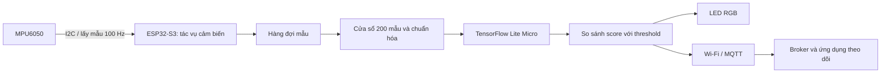

# Fall Detection — ESP32-S3 & MPU6050

Dự án nhận diện té ngã bằng dữ liệu chuyển động từ **MPU6050**, triển khai mô hình học sâu trực tiếp trên **ESP32-S3** bằng TensorFlow Lite Micro. Repository gồm notebook xử lý dữ liệu, huấn luyện và đánh giá mô hình; các file model đã xuất; cùng firmware thu thập cảm biến, suy luận, hiển thị trạng thái qua LED RGB và gửi kết quả qua Wi-Fi/MQTT.

**Phần cứng sử dụng trong hệ thống là ESP32-S3 và MPU6050.** Các file liên quan đến **Polar H10 là thử nghiệm riêng**, không thuộc luồng nhận diện té ngã của hệ thống này và không bắt buộc để chạy dự án.

## Nội dung

- [Tổng quan hệ thống](#tổng-quan-hệ-thống)
- [Cấu trúc repository](#cấu-trúc-repository)
- [Dữ liệu và tiền xử lý](#dữ-liệu-và-tiền-xử-lý)
- [Mô hình và kết quả đánh giá](#mô-hình-và-kết-quả-đánh-giá)
- [Chạy notebook](#chạy-notebook)
- [Lưu và triển khai model](#lưu-và-triển-khai-model)
- [Phần cứng và firmware](#phần-cứng-và-firmware)
- [Theo dõi qua MQTT](#theo-dõi-qua-mqtt)
- [Kiểm thử và xử lý lỗi](#kiểm-thử-và-xử-lý-lỗi)
- [Dữ liệu cục bộ và đóng gói GitHub](#dữ-liệu-cục-bộ-và-đóng-gói-github)

## Tổng quan hệ thống



- MPU6050 cung cấp gia tốc ba trục và vận tốc góc ba trục.
- ESP32-S3 lấy mẫu trên core 0; tác vụ suy luận chạy trên core 1.
- Mỗi cửa sổ chứa 200 mẫu, tương ứng khoảng 2 giây ở 100 Hz; cửa sổ dịch 100 mẫu, tương ứng khoảng 1 giây.
- Mô hình trả về `score` trong khoảng `[0, 1]`. Khi `score >= threshold`, cửa sổ được phân loại là `FALL`; ngược lại là `NORMAL`.
- Suy luận thực hiện trên thiết bị. Firmware có thể tiếp tục nhận diện và báo LED khi không kết nối được mạng; khởi động có bước chờ Wi-Fi tối đa 15 giây.

### Các phiên bản hiện có

| Thành phần | Đặc trưng đầu vào | Kích thước một cửa sổ | Vai trò |
|---|---|---|---|
| [`model_3_features.ipynb`](model_3_features.ipynb) | `AccX`, `AccY`, `AccZ` | `200 × 3`, flatten thành 600 giá trị | Phiên bản chỉ dùng gia tốc XYZ |
| [`model.ipynb`](model.ipynb) | Mặc định: `AccX`, `AccY`, `AccZ`, `AccMag`, `GyrX`, `GyrY`, `GyrZ`, `GyrMag` | `200 × 8`, flatten thành 1.600 giá trị | Thử nghiệm kết hợp gia tốc và con quay hồi chuyển |
| [Firmware ESP32-S3](esp32s3-tinyml-fall-detector/) | Hiện xử lý 8 đặc trưng theo thứ tự của `model.ipynb` | Tensor float32 `[1, 1600]` | Triển khai trên ESP32-S3 + MPU6050 |

Notebook XYZ đã có bộ artifact riêng trong `saved_models_3ft/`. **Firmware hiện chưa chuyển sang đầu vào XYZ 3 đặc trưng**: chỉ chép model XYZ vào firmware sẽ không đủ, vì phần tạo đặc trưng, kiểm tra kích thước và host test vẫn dùng cấu hình 8 đặc trưng.

## Cấu trúc repository

```text
.
├── README.md
├── .gitignore
├── model_3_features.ipynb        # Huấn luyện, đánh giá và export phiên bản Acc XYZ
├── model.ipynb                   # Thử nghiệm các tập đặc trưng IMU
├── model_save.ipynb              # Lưu các biến thể kiến trúc mạng để tham khảo
├── saved_models_3ft/             # Model, scaler, metadata và C/C++ của phiên bản XYZ
├── saved_models/                 # Artifact từ các thử nghiệm khác
├── fall_detection_dataset/       # Dữ liệu cục bộ; CSV không được đưa lên Git
│   ├── Sample_Training/
│   └── Sample_Test/
├── esp32s3-tinyml-fall-detector/
│   ├── CMakeLists.txt
│   ├── sdkconfig.defaults
│   ├── partitions.csv
│   ├── dependencies.lock
│   ├── main/
│   │   ├── Kconfig.projbuild     # GPIO, PSRAM, Wi-Fi và MQTT
│   │   ├── idf_component.yml     # Dependency của ESP-IDF
│   │   ├── app/                 # Khởi tạo, lấy mẫu và tác vụ nhận diện
│   │   ├── drivers/             # MPU6050 và LED RGB
│   │   ├── model/               # Model nhúng, scaler, cửa sổ và TFLite Micro runtime
│   │   └── network/             # Wi-Fi station và MQTT reporter
│   └── tests/                   # Kiểm thử C++ chạy trên máy tính
├── polar_h10.ipynb               # Thử nghiệm riêng với Polar H10 qua BLE
├── polar_h10_dataset/            # Dữ liệu của thử nghiệm Polar H10
├── polar_h10_receiver/           # Thư mục thử nghiệm ngoài luồng chính
└── doc/                         # Bài báo tham khảo cục bộ, được gitignore
```

`model_save.ipynb` chứa các đoạn định nghĩa kiến trúc, không phải pipeline huấn luyện độc lập đầy đủ. Bắt đầu với `model_3_features.ipynb` để làm việc với Acc XYZ.

## Dữ liệu và tiền xử lý

### Bố trí dữ liệu

Đặt dữ liệu tại thư mục gốc dự án theo cấu trúc:

```text
fall_detection_dataset/
├── Sample_Training/
│   └── SAxx/
│       ├── recording_01.csv
│       └── recording_02.csv
└── Sample_Test/
    └── SAyy/
        └── recording_01.csv
```

Mỗi thư mục `SAxx` đại diện cho một subject; mỗi CSV là một recording. Cell đánh giá test hiện chọn các thư mục có tên bắt đầu bằng `SA`.

| Cột | Ý nghĩa / cách sử dụng |
|---|---|
| `FrameCounter` | Sắp xếp mẫu theo thời gian trong từng recording |
| `AccX`, `AccY`, `AccZ` | Gia tốc ba trục; đầu vào của phiên bản XYZ |
| `FallCheck` | Nhãn từng mẫu: `0` là bình thường, `1` là ngã |
| `GyrX`, `GyrY`, `GyrZ` | Vận tốc góc; dùng trong notebook IMU |
| `EulerX`, `EulerY`, `EulerZ` | Dùng khi chọn các tập đặc trưng có Euler trong notebook IMU |
| `TimeStamp(s)` | Có trong dữ liệu hiện có; pipeline tạo cửa sổ sắp xếp bằng `FrameCounter` |

Notebook XYZ chỉ yêu cầu `FrameCounter`, `AccX`, `AccY`, `AccZ`, `FallCheck`. Notebook IMU mặc định bổ sung `AccMag` và `GyrMag` bằng độ lớn vector XYZ tương ứng.

### Quy trình tiền xử lý

1. Đọc CSV, gắn `subject_id`, `recording_id` và tên file nguồn.
2. Chia dữ liệu trong `Sample_Training` thành train/validation theo **subject**, dùng `GroupShuffleSplit(test_size=0.2, random_state=42)`.
3. Tạo cửa sổ 200 mẫu với bước dịch 100 mẫu, riêng cho từng recording. Cửa sổ không nối dữ liệu giữa các recording.
4. Gán nhãn cửa sổ là ngã nếu ít nhất **20% số mẫu** trong cửa sổ có `FallCheck == 1`.
5. Augmentation trên cửa sổ train thô: jitter, scaling và rotation, mỗi phép có xác suất `0.30`. Bản train gốc được ghép với bản augmentation; không dùng time shift.
6. Fit `StandardScaler` theo từng đặc trưng trên **cửa sổ train gốc**. Dùng scaler đó để transform train, train augmentation, validation và test.
7. Tính class weight để xử lý mất cân bằng giữa hai lớp.

Firmware chuyển gia tốc MPU6050 sang đơn vị **g**, vận tốc góc sang **độ/giây**. Dữ liệu đưa vào huấn luyện và dữ liệu từ thiết bị cần thống nhất đơn vị, thứ tự trục, hướng gắn cảm biến và tần số lấy mẫu; notebook không tự chuyển đổi đơn vị đầu vào CSV.

## Mô hình và kết quả đánh giá

### Kiến trúc

Hai notebook huấn luyện sử dụng mạng CNN 1D gồm:

- Reshape vector đầu vào về dạng `(time, features)`.
- Depthwise convolution theo thời gian và pointwise convolution để trộn channel.
- Residual block kết hợp Squeeze-and-Excitation (SE).
- Dilation để mở rộng vùng thời gian được quan sát và một bước downsampling.
- Ghép Global Average Pooling với Global Max Pooling.
- Các lớp Dense, Batch Normalization, Dropout và đầu ra sigmoid một nút.

Huấn luyện ban đầu dùng Adam với learning rate `1e-3`, binary cross-entropy, batch size `32`, tối đa `100` epoch. Checkpoint và early stopping theo `val_recall`; giảm learning rate theo `val_loss`. Phần fine-tuning tải checkpoint tốt nhất, dùng learning rate `1e-4`, tối đa `20` epoch.

Ngưỡng quyết định được quét từ `0.10` đến `0.90`, bước `0.05`, trên validation. Code ưu tiên ngưỡng đạt recall ít nhất `0.95`, sau đó tối đa hóa F2. Nếu không có ngưỡng đạt mục tiêu, ưu tiên recall cao nhất rồi F2. Một đoạn Markdown trong notebook còn mô tả F1; quy tắc trên phản ánh code đang chạy.

### Kết quả lưu trong notebook

Bảng dưới chép từ output đánh giá `Sample_Test` hiện được lưu trong các notebook. Đây là kết quả của lần chạy đã lưu, không phải benchmark mới chạy lại hoặc kết quả đo trực tiếp trên ESP32-S3.

Cả hai output đánh giá **6 subject, 1.999 cửa sổ**, gồm **1.845 cửa sổ bình thường** và **154 cửa sổ ngã**.

| Chỉ số | IMU 8 đặc trưng — `model.ipynb` | Acc XYZ — `model_3_features.ipynb` |
|---|---:|---:|
| Threshold được chọn | 0.55 | 0.50 |
| Accuracy | 0.9550 | 0.9625 |
| Precision lớp ngã | 0.6429 | 0.6927 |
| Recall lớp ngã | 0.9351 | 0.9221 |
| F1 lớp ngã | 0.7619 | 0.7911 |
| F2 lớp ngã | 0.8571 | 0.8648 |
| F1 macro | 0.8685 | 0.8852 |
| ROC-AUC | 0.9889 | 0.9808 |
| TN / FP / FN / TP | 1765 / 80 / 10 / 144 | 1782 / 63 / 12 / 142 |

Cell đánh giá này dùng biến `model` và nằm trước phần fine-tuning. Vì vậy, các số trên không tự động mô tả chất lượng của file `fall_detection_finetuned.keras` hoặc model TFLite đã export. Muốn đánh giá bản fine-tuned, cần chọn lại threshold trên validation bằng chính model đó rồi đánh giá test.

## Chạy notebook

### Môi trường Python

Các thư viện được import trong pipeline chính gồm TensorFlow/Keras, NumPy, pandas, scikit-learn, Matplotlib, seaborn và joblib. Ví dụ chuẩn bị môi trường trên macOS/Linux, từ thư mục gốc dự án:

```bash
python3 -m venv .venv
source .venv/bin/activate
python -m pip install --upgrade pip
python -m pip install tensorflow numpy pandas scikit-learn matplotlib seaborn joblib jupyterlab
python -m jupyter lab
```

Trên Windows, kích hoạt môi trường bằng `.venv\Scripts\activate`. Repository chưa có file khóa dependency Python; output notebook hiện ghi TensorFlow `2.21.0`. Lệnh cài trên không cố định phiên bản nên cần ghi lại môi trường khi tái lập kết quả.

### Thứ tự thực hiện

1. Chuẩn bị dataset đúng cấu trúc ở trên.
2. Mở `model_3_features.ipynb` và chọn kernel của môi trường vừa cài.
3. Tạo thư mục `saved_models_3ft` trước khi train nếu chưa có. Một số cell checkpoint hiện tạo `saved_models` nhưng ghi checkpoint vào `saved_models_3ft`.
4. Chạy lần lượt từ import, đọc dữ liệu, chia subject, augmentation và chuẩn hóa đến huấn luyện.
5. Chạy chọn threshold và đánh giá `Sample_Test`.
6. Chạy fine-tuning nếu cần, rồi chuyển model sang TFLite.
7. Chạy cell **LƯU FILE PKL: SCALER VÀ METADATA (ACC XYZ)** trước cell export C/C++.

Để tạo thư mục output từ terminal:

```bash
mkdir -p saved_models_3ft
```

Các biến preprocessing được giữ trong kernel. Nếu restart kernel, cần khôi phục đúng scaler đã lưu hoặc chạy lại các cell preprocessing với đúng dữ liệu và cấu hình của lần train; không fit scaler trên test.

## Lưu và triển khai model

### Các file đầu ra

| File | Vai trò |
|---|---|
| `best_model.keras` | Checkpoint được chọn trong huấn luyện ban đầu |
| `fall_detection_finetuned.keras` | Checkpoint sau fine-tuning |
| `fall_detection_finetuned.tflite` | Model TFLite; code chuyển đổi hiện dùng Float32 |
| `scaler.pkl` | `StandardScaler` đã fit trên train, lưu bằng joblib |
| `metadata.pkl` | Thứ tự feature, window size/step, threshold và chế độ scaler |
| `model_data.cc`, `model_data.h` | Model TFLite được nhúng thành mảng byte C/C++ |
| `scaler_data.h` | Mean, scale, threshold và cấu hình cửa sổ cho firmware |

Đọc lại file PKL bằng `joblib.load(...)`. Với phiên bản XYZ, các file được lưu vào `saved_models_3ft/`.

### Đồng bộ preprocessing với firmware

Scaler lưu **một mean và một scale cho mỗi đặc trưng**, dùng chung cho tất cả timestep:

```text
scaled[t, f] = (raw[t, f] - mean[f]) / scale[f]
```

Với XYZ, scaler có 3 giá trị mean và 3 giá trị scale; tensor đầu vào vẫn có `200 × 3 = 600` giá trị. Khi xử lý input đã flatten, chỉ số scaler là `i % 3`.

Trong các header hiện lưu, `kInputSize` đang bằng số phần tử scaler (`3` hoặc `8`). Firmware 8 đặc trưng tính kích thước tensor bằng `kWindowSize * kNumFeatures`. Cell export notebook vẫn có cảnh báo so sánh độ dài scaler với toàn bộ cửa sổ; scaler 3 phần tử không đồng nghĩa với việc thiếu 597 tham số.

Để thay model nhúng, cần xuất cùng một bộ `model_data.cc`, `model_data.h`, `scaler_data.h` từ cùng lần huấn luyện, đặt tại `esp32s3-tinyml-fall-detector/main/model/`, rồi build và kiểm thử lại firmware. Threshold phải được chọn cho đúng model đem triển khai.

### Tình trạng artifact hiện tại

- Firmware hiện tạo 8 đặc trưng, dùng threshold `0.55`; `model_input.cc` có kiểm tra cố định 8 đặc trưng và host test cũng kiểm tra thứ tự 8 đặc trưng.
- `saved_models_3ft/scaler_data.h` khai báo XYZ và threshold `0.50`; model Keras fine-tuned trong thư mục này có đầu vào 600 giá trị.
- `saved_models/` chứa artifact từ nhiều lần thử nghiệm: file `fall_detection_finetuned.keras` hiện có đầu vào 600 giá trị, trong khi `scaler_data.h` khai báo 8 đặc trưng. Không xem toàn bộ thư mục này là một bộ model/scaler đồng nhất chỉ dựa vào tên file.
- Khi chuyển firmware sang XYZ, cần cập nhật phần tạo feature và kiểm tra kích thước trong `main/model/`, các artifact nhúng và `tests/model_checks.cc` cùng nhau.

## Phần cứng và firmware

### Thiết bị

| Thành phần | Vai trò |
|---|---|
| ESP32-S3 | Thu thập dữ liệu, chạy TFLite Micro, điều khiển LED và gửi MQTT |
| MPU6050 | Đo gia tốc và vận tốc góc qua I2C |
| LED RGB WS2812 | Hiển thị trạng thái; firmware cấu hình một LED |
| Cáp USB và dây nối | Nguồn, nạp chương trình, serial monitor và kết nối cảm biến |
| Máy tính chạy MQTT broker | Nhận kết quả qua mạng; tùy chọn đối với nhận diện tại chỗ |

`sdkconfig.defaults` hướng tới ESP32-S3 **N16R8**, cấu hình flash 16 MB và Octal PSRAM. Tensor arena mặc định là **256 KiB trong PSRAM**; cấu hình PSRAM phải phù hợp board thực tế.

### Đấu nối

| MPU6050 | ESP32-S3 |
|---|---|
| VCC | 3.3 V |
| GND | GND |
| SDA | GPIO 8 |
| SCL | GPIO 9 |
| AD0 | GND để dùng địa chỉ I2C `0x68` |

GPIO 8/9 là cấu hình trong `sdkconfig.defaults`; fallback trong `Kconfig.projbuild` là SDA 4/SCL 5. Kiểm tra giá trị thực tế trong `menuconfig` khi dùng `sdkconfig` đã tồn tại. Tốc độ I2C được cấu hình là 400 kHz. Driver đặt thang gia tốc ±8 g và con quay hồi chuyển ±250 độ/giây.

LED RGB mặc định dùng GPIO 48; có thể đổi trong `menuconfig` theo sơ đồ board. GPIO LED phải khác GPIO I2C.

### Build và nạp

Theo manifest và CMake của firmware, cần môi trường **ESP-IDF >= 6.0.0**, target `esp32s3`, CMake >= 3.22. Dependency khai báo gồm `espressif/esp-tflite-micro` phiên bản `1.3.7`, `espressif/led_strip` phiên bản `3.0.3` và `espressif/mqtt` với ràng buộc `^1.0.0`.

Sau khi đã cài và kích hoạt môi trường ESP-IDF, chạy từ thư mục gốc repository:

```bash
cd esp32s3-tinyml-fall-detector
idf.py set-target esp32s3
idf.py menuconfig
idf.py build
idf.py -p YOUR_SERIAL_PORT flash monitor
```

Thay `YOUR_SERIAL_PORT` bằng cổng thực tế, ví dụ `/dev/ttyACM0`, `/dev/cu.usbmodem...` hoặc `COM3`. Thoát monitor bằng `Ctrl + ]`.

Trong `menuconfig`, cấu hình:

- **MPU6050 Fall Detection Configuration**: SDA/SCL, tần số I2C, GPIO/độ sáng RGB và kích thước tensor arena.
- **WiFi and MQTT Configuration**: SSID, mật khẩu, IP broker và port, mặc định port `1883`.
- Flash và PSRAM phù hợp với board đang dùng.

Firmware sử dụng bảng phân vùng `partitions.csv` với app partition 3 MiB. Cần có đầy đủ file này và mã nguồn firmware trước khi build.

### Trạng thái LED

| Trạng thái | LED |
|---|---|
| Khởi tạo / thu thập cửa sổ đầu tiên | Xanh dương mờ |
| Bình thường | Tắt |
| Nhận diện ngã | Đỏ |
| Lỗi cảm biến, dữ liệu hoặc suy luận | Cam |
| Không nhận cập nhật trạng thái trong 5 giây | Cam |

Firmware kiểm tra số thứ tự mẫu, khoảng lấy mẫu 5–15 ms, NaN/Inf và dữ liệu tồn trong queue quá lâu. Cửa sổ bị gián đoạn sẽ được thu thập lại. Suy luận vượt ngân sách 1.000 ms được coi là lỗi; đây là giới hạn trong code, không phải số đo độ trễ benchmark.

## Theo dõi qua MQTT

Cấu hình broker cho phép ESP32-S3 kết nối qua mạng LAN, rồi đặt IP/port tương ứng trong `menuconfig`. Từ máy tính có MQTT client, đăng ký các topic:

```bash
mosquitto_sub -h BROKER_IP -p 1883 -t 'fall-detector/#' -v
```

| Topic | Nội dung |
|---|---|
| `fall-detector/result` | `status`, `score`, `time_ms` cho cửa sổ suy luận thành công |
| `fall-detector/error` | Lỗi suy luận hoặc vượt thời gian; giới hạn gửi tối đa một lần mỗi 5 giây |
| `fall-detector/online` | Trạng thái kết nối `online` / `offline`, có Last Will |

Ví dụ minh họa định dạng payload, không phải kết quả đo:

```json
{"status":"FALL","score":0.82,"time_ms":500}
```

`time_ms` là thời gian chạy suy luận, không bao gồm toàn bộ thời gian thu cửa sổ. Kết quả gửi với QoS 1 khi client đang kết nối. Các lỗi lấy mẫu còn được báo qua serial log và LED; không phải mọi lỗi cảm biến đều được publish lên MQTT.

## Kiểm thử và xử lý lỗi

### Host test

`tests/model_checks.cc` kiểm tra thời điểm cửa sổ sẵn sàng, thứ tự mẫu, feature/magnitude/scaling, mất mẫu, timestamp bất thường, NaN/Inf, vòng quay sequence counter, khởi tạo và chạy model thực bằng TFLite Micro.

Ví dụ chạy trên Linux có CMake, Ninja và C++ compiler; từ thư mục firmware, trong môi trường ESP-IDF đã kích hoạt:

```bash
idf.py reconfigure
cmake -S tests -B /tmp/fall-detector-host-checks -G Ninja
cmake --build /tmp/fall-detector-host-checks
ctest --test-dir /tmp/fall-detector-host-checks --output-on-failure
```

`idf.py reconfigure` tải managed components cần cho host test. CMake test hiện dùng linker flag `--gc-sections` của GNU; trên macOS cần điều chỉnh flag phù hợp trước khi dùng Apple linker. Host test kiểm tra logic và suy luận trên máy tính, không thay thế kiểm tra I2C, timing, PSRAM và nhận diện trên board thực tế.

### Lỗi thường gặp

| Hiện tượng | Cách kiểm tra |
|---|---|
| Không tìm thấy dataset | Đặt CSV đúng `fall_detection_dataset/Sample_Training` và `Sample_Test`; chạy notebook từ gốc dự án |
| Thiếu `saved_models_3ft/scaler.pkl` | Chạy cell lưu PKL khi kernel còn đúng scaler đã fit và `best_threshold` |
| Cell lưu PKL báo thiếu biến | Chạy các cell preprocessing/chọn threshold tương ứng hoặc khôi phục đúng trạng thái của lần train |
| Model XYZ không khớp firmware | Đồng bộ số feature, tensor input, scaler, model nhúng và host test; firmware hiện dùng 8 feature |
| Không đọc được MPU6050 | Kiểm tra nguồn, GND, SDA/SCL thực tế, AD0 và địa chỉ `0x68` |
| LED cam, báo không cấp phát được arena | Kiểm tra PSRAM và `FALL_MODEL_ARENA_KB` |
| LED cam, báo sample gap | Xem lỗi I2C, sequence, khoảng lấy mẫu và tình trạng queue trong serial monitor |
| Không có dữ liệu MQTT | Kiểm tra SSID, IP broker, port, khả năng truy cập từ LAN và log kết nối |

## Dữ liệu cục bộ và đóng gói GitHub

`.gitignore` loại các file CSV/H5, môi trường Python, cache và thư mục `/doc/`. Dataset và bài báo trong `doc/` được giữ cục bộ; người clone repository cần tự chuẩn bị dữ liệu để chạy huấn luyện.

Trong cấu trúc Git hiện tại, `esp32s3-tinyml-fall-detector/` được lưu như **gitlink tới một repository riêng**, nhưng repository gốc chưa có `.gitmodules`. Vì vậy, clone repository gốc có thể chưa lấy được mã nguồn firmware. Khi đóng gói bản chia sẻ, cần đưa firmware vào dưới dạng thư mục mã nguồn thông thường hoặc cấu hình submodule đầy đủ với URL truy cập được. `partitions.csv` hiện được theo dõi trong repo firmware; nếu chuyển sang thư mục thường, cần giữ file cấu hình này dù `.gitignore` gốc đang bỏ qua `*.csv`.

Các thử nghiệm Polar H10 có thể được lưu để tham khảo, nhưng không nằm trong yêu cầu cài đặt hoặc phần cứng của hệ thống ESP32-S3 + MPU6050. Repository gốc hiện chưa có file `LICENSE`; README này không gán thêm giấy phép cho mã nguồn, dataset hoặc bài báo.
